# Medical Knowledge Graph: Drug Repurposing Explorer

> **Educational Project**: A student-led exploration of Graph Neural Networks and biomedical knowledge graphs for learning modern ML/AI techniques

[](https://www.python.org/downloads/)
[](https://pytorch.org/)
[](https://neo4j.com/)
[](LICENSE)

---

## ⚠️ Important Notice

**This is a personal learning and portfolio project, NOT a rigorous scientific research effort.**

This project is designed to:
- **Learn** modern ML/AI techniques (Graph Neural Networks, NLP, Knowledge Graphs)
- **Demonstrate** end-to-end software engineering skills
- **Showcase** technical capabilities for internship/job applications
- **Explore** biomedical informatics as an interesting problem domain

**NOT intended for:**
- ❌ Clinical decision making
- ❌ Medical research or drug discovery
- ❌ Production deployment in healthcare settings
- ❌ Peer-reviewed scientific publication

The biomedical domain provides a rich, real-world dataset to learn GNN and knowledge graph techniques that transfer to many other applications (recommendation systems, social networks, fraud detection, etc.).

---

## 🎯 Project Overview

Drug development traditionally takes 10+ years and costs $2.6 billion. This project explores how **Graph Neural Networks** and **biomedical knowledge graphs** could be used to identify new uses for existing FDA-approved drugs.

This is a **proof-of-concept implementation** to learn and demonstrate:
1. How to extract structured information from unstructured text using NLP
2. How to build and query knowledge graphs with Neo4j
3. How to apply Graph Neural Networks for link prediction
4. How to build end-to-end ML pipelines from data collection to web deployment

### What This Project Demonstrates

**Technical Skills:**
- REST API integration (PubMed, PubChem)
- Biomedical NLP using SciSpacy and transformers
- Graph database design and Cypher queries
- PyTorch and PyTorch Geometric for GNNs
- Full ML pipeline (data → model → evaluation → deployment)
- Interactive web applications with Streamlit

**Software Engineering:**
- Clean, modular code architecture
- Data pipeline development
- Version control with Git
- Documentation and testing
- End-to-end feature ownership

---

## 🏗️ System Architecture

This section provides the complete technical architecture of the solution.

### High-Level Architecture


### Detailed Data Flow Diagram

This diagram shows the **exact files and scripts** with inputs and outputs:

```mermaid
graph LR
    subgraph Week1[Week 1: Data Collection]
        S1[collect_pubmed.py]
        S2[collect_pubchem.py]
        O1[pubmed_abstracts.json<br/>924 papers]
        O2[pubchem_drugs.csv<br/>107 drugs]

        S1 -->|writes| O1
        S2 -->|writes| O2
    end

    subgraph Week2[Week 2: NLP Processing]
        I1[pubmed_abstracts.json]
        S3[extract_entities.py]
        S4[extract_relationships.py]
        S5[create_knowledge_base.py]
        O3[entities.csv<br/>1,514 entities]
        O4[relationships.csv<br/>666 relationships]
        O5[knowledge_base.json]

        I1 -->|reads| S3
        S3 -->|writes| O3
        I1 -->|reads| S4
        O3 -->|reads| S4
        S4 -->|writes| O4
        O3 -->|reads| S5
        O4 -->|reads| S5
        S5 -->|writes| O5
    end

    subgraph Week3[Week 3: Graph Database]
        I2[entities.csv]
        I3[relationships.csv]
        S6[load_to_neo4j.py]
        O6[Neo4j Graph DB<br/>1,514 nodes<br/>663 edges]
        Q1[cypher_queries.cypher<br/>60+ queries]

        I2 -->|reads| S6
        I3 -->|reads| S6
        S6 -->|creates| O6
        O6 -->|queries| Q1
    end

    subgraph Week4[Week 4: GNN Training]
        I4[Neo4j DB]
        S7[export_graph_data.py]
        S8[prepare_training_data.py]
        S9[train_gnn.py]
        S10[evaluate_gnn.py]
        S11[generate_predictions.py]
        O7[graph_data.pt]
        O8[train_data.pt<br/>val_data.pt<br/>test_data.pt]
        O9[best_model.pt<br/>AUC: 0.8693]
        O10[test_metrics.json<br/>training_history.json]
        O11[novel_predictions.csv<br/>100 candidates]

        I4 -->|exports| S7
        S7 -->|writes| O7
        O7 -->|reads| S8
        S8 -->|writes| O8
        O8 -->|reads| S9
        S9 -->|writes| O9
        O9 -->|reads| S10
        O8 -->|reads| S10
        S10 -->|writes| O10
        O9 -->|reads| S11
        O7 -->|reads| S11
        S11 -->|writes| O11
    end

    subgraph Week5[Week 5: Dashboard]
        I5[novel_predictions.csv]
        S12[validate_predictions.py]
        S13[streamlit app]
        O12[validation_report.csv<br/>validation_summary.json]
        O13[Interactive Dashboard<br/>4 pages]

        I5 -->|reads| S12
        S12 -->|writes| O12
        O11 -->|reads| S13
        O10 -->|reads| S13
        O6 -->|reads| S13
        O12 -->|reads| S13
        S13 -->|serves| O13
    end

    O1 -.->|Week 1→2| I1
    O3 -.->|Week 2→3| I2
    O4 -.->|Week 2→3| I3
    O6 -.->|Week 3→4| I4
    O11 -.->|Week 4→5| I5

    style S1 fill:#e3f2fd
    style S2 fill:#e3f2fd
    style S3 fill:#f3e5f5
    style S4 fill:#f3e5f5
    style S5 fill:#f3e5f5
    style S6 fill:#e8f5e9
    style S7 fill:#fff3e0
    style S8 fill:#fff3e0
    style S9 fill:#fff3e0
    style S10 fill:#fff3e0
    style S11 fill:#fff3e0
    style S12 fill:#fce4ec
    style S13 fill:#fce4ec
    style O9 fill:#ffeb3b
    style O13 fill:#ffeb3b
```



### Component Details

#### 1. Data Collection Layer
- **PubMed Scraper**: Collects research paper abstracts via E-utilities API
- **PubChem Client**: Fetches drug information and chemical properties
- **DisGeNET Loader**: Processes gene-disease association data

#### 2. Data Processing Layer
- **NLP Pipeline**: BC5CDR model for biomedical entity recognition
- **Entity Extraction**: Identifies CHEMICAL (drugs) and DISEASE entities
- **Relationship Extraction**: Pattern-based extraction of drug-disease associations
- **Data Storage**: JSON for raw data, CSV for processed relationships

#### 3. Knowledge Graph Layer
- **Database**: Neo4j graph database
- **Schema**:
  - Nodes: Drug, Disease, Gene, Protein
  - Relationships: TREATS, CAUSES, TARGETS, ASSOCIATED_WITH
- **Query Language**: Cypher for graph traversal and pattern matching

#### 4. Machine Learning Layer
- **Model**: GraphSAGE (Graph Sample and Aggregate)
- **Task**: Link prediction (predict missing TREATS relationships)
- **Framework**: PyTorch Geometric
- **Training**: M1 GPU with MPS backend
- **Evaluation**: AUC-ROC, Precision@K metrics

#### 5. Application Layer
- **Web Framework**: Streamlit
- **Visualizations**: NetworkX for graph layout, Plotly for interactive charts
- **Features**: Prediction explorer, graph browser, entity search

---

## 🔄 Sequence Diagrams

### Data Collection Workflow

```mermaid
sequenceDiagram
    participant U as User
    participant S as Script
    participant PM as PubMed API
    participant PC as PubChem API
    participant F as Files

    U->>S: collect_pubmed.py
    S->>PM: Search papers
    PM-->>S: PMIDs list

    loop Batch 200
        S->>PM: Fetch abstracts
        Note over S,PM: 0.4s delay
        PM-->>S: XML data
        S->>S: Parse XML
    end

    S->>F: pubmed_abstracts.json
    F-->>U: 924 papers ✓

    U->>S: collect_pubchem.py

    loop Each drug
        S->>PC: Query by name
        PC-->>S: Compound data
        S->>S: Extract fields
    end

    S->>F: pubchem_drugs.csv
    F-->>U: 107 drugs ✓
```



### NLP Processing Workflow

```mermaid
sequenceDiagram
    participant U as User
    participant S as Script
    participant D as Data
    participant N as BC5CDR
    participant O as Output

    U->>S: extract_entities.py
    S->>D: Load abstracts
    D-->>S: 924 papers

    loop Each abstract
        S->>N: Process text
        N->>N: Tokenize
        N->>N: NER
        N-->>S: Entities

        S->>S: Extract pairs
        S->>S: Pattern match
    end

    S->>S: Deduplicate
    S->>S: Normalize

    S->>O: entities.csv
    S->>O: relationships.csv
    O-->>U: KB ready ✓
```



### Graph Construction Workflow

```mermaid
sequenceDiagram
    participant U as User
    participant S as Script
    participant D as Data
    participant N as Neo4j

    U->>S: load_to_neo4j.py
    S->>D: Load entities.csv
    S->>D: Load relationships.csv

    S->>N: Connect
    N-->>S: Connected ✓

    S->>N: Create constraints

    loop 718 drugs
        S->>N: CREATE Drug
    end

    loop 796 diseases
        S->>N: CREATE Disease
    end

    loop 663 edges
        S->>N: CREATE TREATS
    end

    S->>N: Create indexes
    N-->>S: Complete ✓

    S->>N: Count nodes
    N-->>U: 1,514 nodes, 663 edges
```



### Model Training Workflow


### Prediction & Demo Workflow


---

## 🛠️ Tech Stack

| Layer | Technology | Purpose |
|-------|-----------|---------|
| **Data Collection** | Python `requests`, REST APIs | PubMed, PubChem data fetching |
| **NLP** | SciSpacy, BC5CDR, Transformers | Biomedical entity extraction |
| **Data Storage** | JSON, CSV, Pandas | Raw and processed data |
| **Graph Database** | Neo4j 5.x, Cypher | Knowledge graph storage & queries |
| **ML Framework** | PyTorch 2.9+, PyTorch Geometric | Graph Neural Networks |
| **Compute** | M1 GPU (MPS backend) | Model training acceleration |
| **Web App** | Streamlit | Interactive demo interface |
| **Visualization** | NetworkX, Plotly, Matplotlib | Graph and data visualization |
| **Environment** | Python 3.11, venv | Dependency management |

---

## 📊 Current Status

**Week 1: Data Collection** ✅ Complete
- 924 PubMed research papers (2020-2024)
- 107 FDA-approved drugs with metadata
- Data quality validated and ready

**Week 2: NLP Processing** ✅ Complete
- Entity extraction: 1,514 entities (718 drugs, 796 diseases)
- Relationship extraction: 666 drug-disease relationships
- Knowledge base constructed and validated

**Week 3: Graph Construction** ✅ Complete
- Neo4j database with 1,514 nodes, 663 edges
- Graph schema implemented (Drug, Disease nodes; TREATS relationships)
- 60+ Cypher queries for graph exploration

**Week 4: Model Training** ✅ Complete
- GraphSAGE GNN with 7,073 parameters
- Test AUC: **0.8693** (exceeds target of 0.75 by 16%)
- Precision@10: **1.0000** (perfect top predictions!)
- 100 novel drug repurposing predictions generated

**Week 5: Dashboard & Validation** ✅ Complete
- Literature validation: 13 novel, 5 emerging, 2 confirmed predictions
- Interactive Streamlit dashboard with 4 pages
- 15+ interactive visualizations
- Production-ready web application

**Week 6: Portfolio Materials** 🔄 In Progress
- Technical documentation
- Demo preparation
- Final polish

---

## 🚀 Quick Start

### Prerequisites

- Python 3.11+
- 16GB RAM recommended (8GB minimum)
- macOS (M1/M2/M3) or Linux
- ~10GB free disk space

### Installation

```bash
# Clone repository
git clone https://github.com/yourusername/medical-kg-drug-repurposing.git
cd medical-kg-drug-repurposing

# Create virtual environment
python3.11 -m venv venv
source venv/bin/activate  # On Windows: venv\Scripts\activate

# Install dependencies
pip install -r requirements.txt

# Download biomedical NLP model
pip install https://s3-us-west-2.amazonaws.com/ai2-s2-scispacy/releases/v0.5.1/en_ner_bc5cdr_md-0.5.1.tar.gz

# Install and start Neo4j (macOS)
brew install neo4j
brew services start neo4j
# Access Neo4j Browser at http://localhost:7474
# Default credentials: neo4j/neo4j
```

### Validate Setup

```bash
# Test environment
python test_setup.py

# Expected output: All checks pass ✅
```

---

## 📁 Project Structure

```
medical-kg-drug-repurposing/
├── data/
│   ├── raw/                    # Raw data from APIs
│   │   ├── pubmed_abstracts.json    (924 papers)
│   │   └── pubchem_drugs.csv        (107 drugs)
│   ├── processed/              # Cleaned, structured data
│   │   ├── entities.csv
│   │   └── relationships.csv
│   └── samples/                # Small samples for testing
│
├── scripts/
│   ├── data_collection/        # Data fetching scripts
│   │   ├── collect_pubmed.py
│   │   └── collect_pubchem.py
│   ├── preprocessing/          # NLP and data processing
│   ├── training/               # Model training scripts
│   └── evaluation/             # Model evaluation
│
├── notebooks/
│   ├── exploratory/            # Data exploration
│   ├── development/            # Model development
│   └── demo/                   # Demo notebooks
│
├── app/
│   ├── main.py                 # Streamlit app entry point
│   ├── components/             # UI components
│   ├── pages/                  # Multi-page app
│   └── utils/                  # Helper functions
│
├── models/
│   ├── checkpoints/            # Training checkpoints
│   └── trained/                # Final trained models
│
├── tests/                      # Unit and integration tests
├── requirements.txt            # Python dependencies
├── test_setup.py              # Environment validation
└── README.md                  # This file
```

---

## 📚 Data Sources

All data sources are publicly available and free to use for educational purposes:

| Source | Content | Size | License |
|--------|---------|------|---------|
| [PubMed](https://pubmed.ncbi.nlm.nih.gov/) | Research paper abstracts | 924 papers | Public Domain |
| [PubChem](https://pubchem.ncbi.nlm.nih.gov/) | Drug chemical properties | 107 drugs | Public Domain |
| [DisGeNET](https://www.disgenet.org/) | Gene-disease associations | Optional | CC BY-NC-SA 4.0 |

**Note**: While data is publicly available, this project uses small subsets for educational purposes only.

---

## 🧠 Learning Resources

This project helped me learn:

**Graph Neural Networks**:
- [PyTorch Geometric Tutorials](https://pytorch-geometric.readthedocs.io/)
- GraphSAGE paper: [Hamilton et al., 2017](https://arxiv.org/abs/1706.02216)

**Biomedical NLP**:
- [SciSpacy Documentation](https://allenai.github.io/scispacy/)
- BC5CDR dataset for entity recognition

**Knowledge Graphs**:
- [Neo4j Graph Academy](https://graphacademy.neo4j.com/)
- Cypher query language

**End-to-End ML**:
- Data collection → Processing → Modeling → Deployment
- Best practices for reproducibility

---

## 🎓 Skills Demonstrated

### Technical
- ✅ REST API integration and data collection
- ✅ Natural Language Processing (NLP) for entity extraction
- ✅ Graph database design and Cypher queries
- ✅ Graph Neural Networks (PyTorch Geometric)
- ✅ ML pipeline development (data → model → evaluation)
- ✅ Web application development (Streamlit)
- ✅ GPU-accelerated training (M1 MPS)

### Software Engineering
- ✅ Clean, modular code architecture
- ✅ Version control (Git)
- ✅ Documentation and testing
- ✅ Virtual environment management
- ✅ End-to-end feature ownership

### Problem Solving
- ✅ Working with unfamiliar domains (biomedical informatics)
- ✅ Handling large, unstructured datasets
- ✅ Building explainable AI systems
- ✅ Balancing scope vs. timeline (pragmatic approach)

---

## 📝 License

This project is licensed under the MIT License - see [LICENSE](LICENSE) file for details.

**Dataset Licenses**:
- PubMed abstracts: Public Domain (U.S. Government work)
- PubChem data: Public Domain (U.S. Government work)
- DisGeNET: CC BY-NC-SA 4.0 (if used)

---

## 🙏 Acknowledgments

**Data Sources**:
- [PubMed/NIH](https://pubmed.ncbi.nlm.nih.gov/) for biomedical literature
- [PubChem](https://pubchem.ncbi.nlm.nih.gov/) for drug information

**Open Source Libraries**:
- [PyTorch](https://pytorch.org/) and [PyTorch Geometric](https://pytorch-geometric.readthedocs.io/)
- [Neo4j](https://neo4j.com/) graph database
- [SciSpacy](https://allenai.github.io/scispacy/) for biomedical NLP
- [Streamlit](https://streamlit.io/) for rapid web app development

**Inspiration**:
- Research on computational drug repurposing
- Graph ML community and tutorials

---

## 📧 Contact

**Karan Kukadia** - [kkukadia@iu.edu](mailto:kkukadia@iu.edu)

Project Link: [https://github.com/yourusername/medical-kg-drug-repurposing](https://github.com/yourusername/medical-kg-drug-repurposing)

---

## 📌 Disclaimer

This project is for **educational and portfolio purposes only**. It is not intended for:
- Medical diagnosis or treatment recommendations
- Clinical decision support
- Drug discovery or pharmaceutical research
- Any production healthcare applications

The techniques demonstrated here (Graph Neural Networks, NLP, Knowledge Graphs) are broadly applicable to many domains beyond healthcare, including recommendation systems, fraud detection, social network analysis, and more.

**Always consult qualified healthcare professionals for medical advice.**

---

**Status**: 🟢 Active Development | **Type**: Learning & Portfolio Project | **Timeline**: 5-6 weeks
